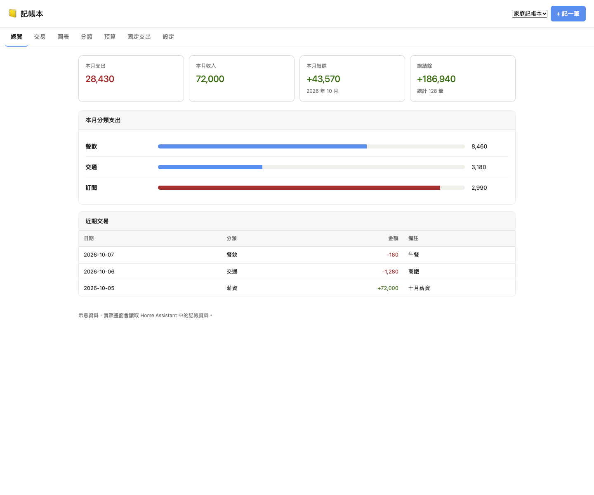
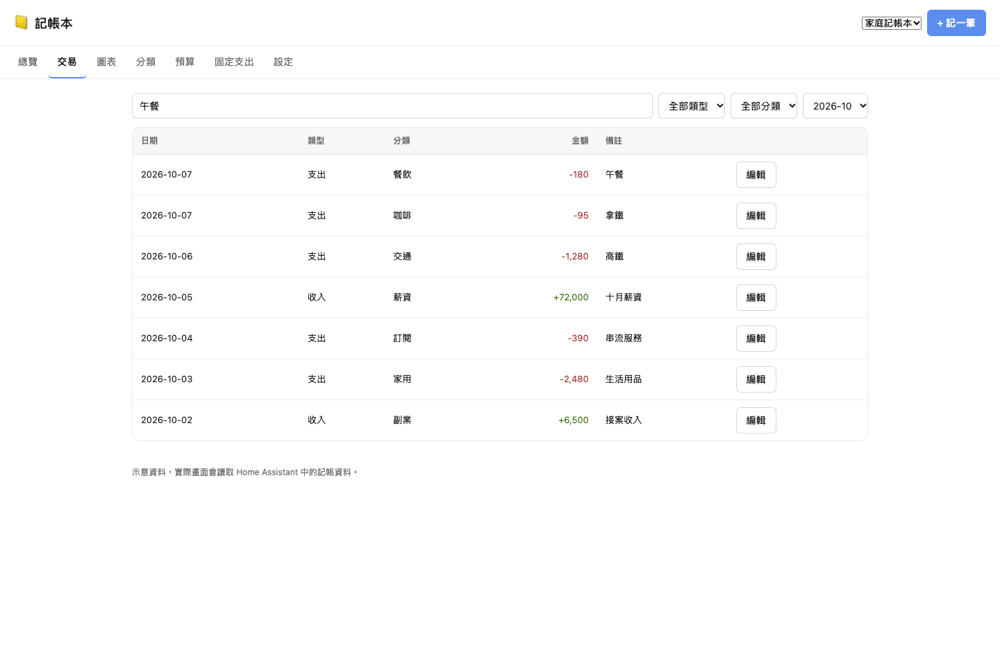
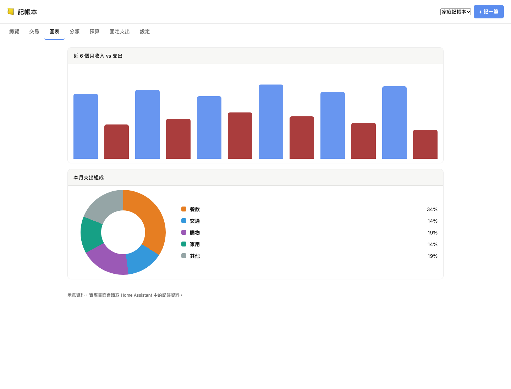
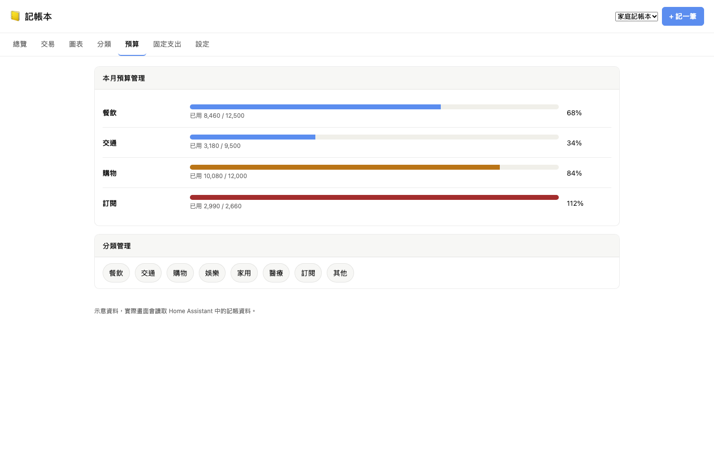
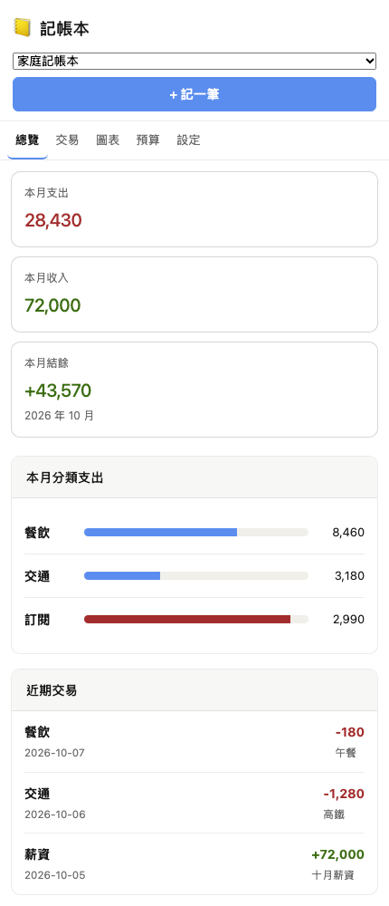

# Budget Book

[繁體中文](README.zh-TW.md)

A Home Assistant custom integration that adds a sidebar budgeting panel with transaction tracking, income and expense summaries, category budgets, recurring expenses, and JSON import/export. Data is stored in Home Assistant storage, so it is included with your regular HA backups.

## Screenshots

### Desktop

| Overview | Transactions |
| --- | --- |
|  |  |

| Charts | Budgets |
| --- | --- |
|  |  |

### Mobile



## Features

- Manage multiple budget books for household, personal, or project expenses.
- Record income and expenses with categories, notes, dates, and times.
- Track monthly expenses, monthly income, monthly balance, and total balance.
- View category spending, six-month trends, and budget usage charts.
- Set monthly category budgets with 80% warning and over-budget alerts.
- Configure recurring monthly entries that are checked automatically every day at 09:00.
- Import, export, and load sample data as JSON.

## Installation

### Manual Installation

1. Create the integration directory in your Home Assistant config folder:

   ```bash
   mkdir -p /config/custom_components/budget_book
   ```

2. Copy this project into that directory. If Git is available on your Home Assistant host, you can clone it directly:

   ```bash
   git clone https://github.com/Im-Tim-mI/budget_book.git /config/custom_components/budget_book
   ```

3. Restart Home Assistant.

4. Go to Settings -> Devices & services -> Add integration, then search for "Budget Book" or "記帳本" and add it.

5. After the integration is added, "記帳本" will appear in the Home Assistant sidebar. Open it to start adding transactions or load the sample data first.

### Updating

If you installed with Git:

```bash
cd /config/custom_components/budget_book
git pull
```

Restart Home Assistant after updating.

## Services

The integration provides services under the `budget_book` domain. They can be called from automations or Developer Tools, for example:

- `budget_book.add_transaction`
- `budget_book.delete_transaction`
- `budget_book.create_book`
- `budget_book.set_budget`
- `budget_book.add_category`
- `budget_book.add_recurring`
- `budget_book.run_recurring`
- `budget_book.replace_data`

See `services.yaml` for the full field definitions.

## License

This project is licensed under the MIT License.
